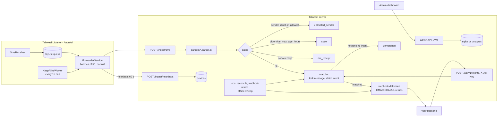

# How Tahweel works

## Why

In Egypt and similar markets, small businesses get paid through mobile wallets. There is no merchant API for a personal wallet: the only trustworthy record of a transfer is the SMS the operator sends to the wallet phone. Today the customer transfers, screenshots the wallet app, sends the screenshot on WhatsApp, and a human compares it with the phone. Tahweel turns that phone into a payment gateway: the phone becomes a durable SMS pipe and every rule (parsing, trust, matching, notifications) moves to a server you control, so a rule change is a deploy and never an APK reinstall.

## Architecture

## How matching works

1. The phone forwards **every** SMS with a `fingerprint = sha256(address|body|smsc_timestamp)`. Duplicates are accepted and dropped.
2. The parser registry (`packages/server/src/parsers/`) picks the provider whose `detect()` claims the message and extracts amount, sender phone (normalised to 11 local digits), sender name, balance and reference. Anything that is not an incoming transfer is stored as `not_receipt` (OTPs, marketing, outgoing transfers).
3. **Sender gate**: the originating address must be an alphanumeric operator sender id on the trusted list (defaults come from the parsers; editable in Settings). Ordinary phone numbers never pass. Otherwise the row is `untrusted_sender`.
4. **Age gate**: receipts older than `max_age_hours` (default 48) are stored as `stale` and never auto-matched, so replayed history cannot re-credit old payments.
5. **Matching**: the oldest pending, unexpired intent with the same `sender_phone` and `amount <= paid amount` wins (overpayment is fine, underpayment never matches). Intents without a sender phone must opt in with `allow_amount_only` and only match an **exact** amount when exactly one such intent is pending.
6. **Lock before apply**: the message flips `unmatched → matching` and the intent `pending → matched` with conditional updates, so two reconcilers (or two processes) cannot apply the same receipt twice. Runs on every ingest, on every intent creation, and every `RECONCILE_INTERVAL_MINUTES`.
7. **Webhook**: `payment.matched` with the intent and the message, signed with the webhook secret, retried with backoff for up to 8 attempts. Everything else is visible in the dashboard where an operator can match by hand, ignore, reopen or re-trust.

## Adding a new wallet SMS template

Drop `packages/server/src/parsers/<provider>.parser.ts` (exporting `defineParser({ id, name, senderIds, detect, parse })`) and `<provider>.samples.json` with real messages and their expected output. The registry discovers the file at boot, its sender ids join the default trusted list, and the generic test asserts every sample. No other edit needed. Worked example in [parsers.md](parsers.md).

## Limits (deliberate)

- **No USSD polling** and no reading of wallet-app notifications: the operator SMS is the only source.
- **Sender ids are spoofable on some networks**, which is why the allowlist plus the age gate plus a per-intent sender phone are all on by default. Keep `allow_amount_only` off unless you accept that risk.
- **One phone = one wallet number.** Several phones can report to one server (each is a device), but a message is matched by amount and sender phone only, never by the receiving wallet.
- **Orange Cash receipts carry the sender's name but not their number** (and an agent cash-in carries neither), so they cannot satisfy an intent bound to a `sender_phone`. They auto-match intents created with `allow_amount_only` and otherwise wait under **Messages** for a manual match.
- Egyptian phone numbers (`01xxxxxxxxx`) are assumed by the bundled parsers; the normaliser lives in one file and is easy to extend.
- When a carrier changes its template, receipts land as `not_receipt`: nothing is lost, you add a sample and a parser tweak.

## Roadmap

- Parsers for InstaPay and bank transfer SMS with community samples; matching Orange Cash receipts by sender name.
- Multi-country phone normalisation.
- Per-integrator API keys and webhook secrets.
- Dashboard charts and CSV export.
- Push notification channel for operator alerts (Telegram / ntfy).
