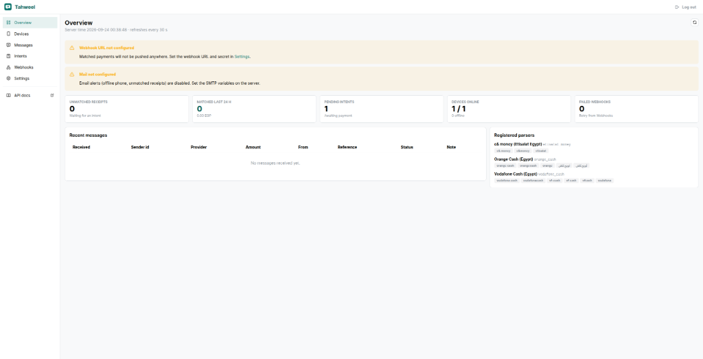
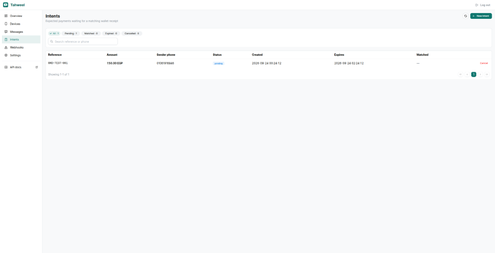
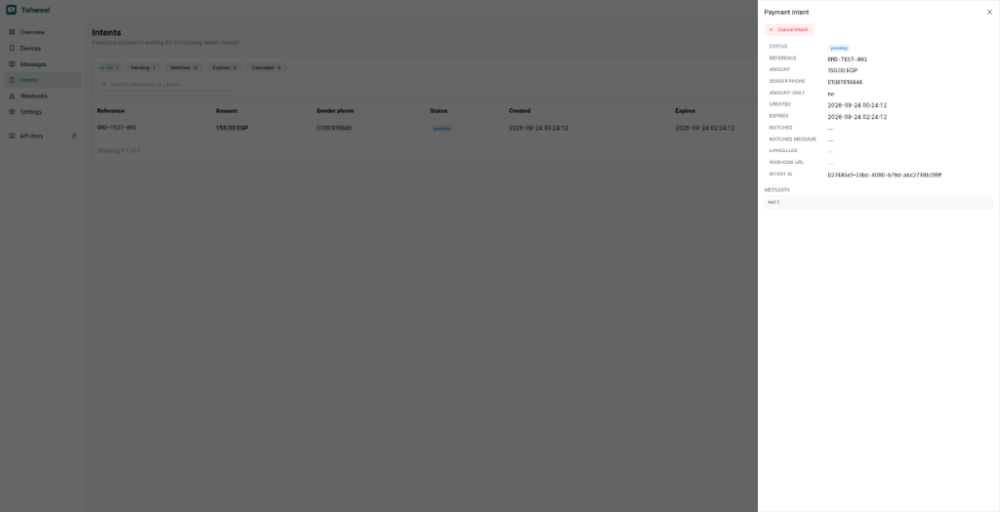

# 🔌 @tahweel/mcp

> **Model Context Protocol (MCP) Server for [Tahweel (تحويل)](https://github.com/ashrafeldawody/Tahweel)**  
> Turn your self-hosted mobile wallet gateway (Vodafone Cash, e& money, Orange Cash) into autonomous AI agent tools.

[](LICENSE)
[](https://modelcontextprotocol.io)
[](https://www.typescriptlang.org/)

---

## 💡 Concept

In Egypt and regional markets, millions of transactions happen daily over **personal mobile wallets** (Vodafone Cash, e& money, Orange Cash). While these personal wallets lack formal merchant APIs, every transfer triggers an official operator SMS receipt. **Tahweel** turns a spare Android phone holding the wallet SIM into an automated gateway.

**`@tahweel/mcp`** bridges that physical payment rail directly to LLMs and AI Agents (Claude Code, Cursor, Windsurf, Agents Office). AI agents can:
1. **Autonomously generate payment intents** during WhatsApp, website, or DM checkout sessions.
2. **Poll and verify payment status** with zero human delay and no fake screenshot fraud.
3. **Monitor device telemetry** (battery %, online status, pending SMS queues) to prevent gateway downtime.
4. **Resolve unallocated transfers** when a customer pays with a slight mismatch.

---

## 🏛️ System Architecture

Interactive standalone visual architecture: **[`docs/architecture.html`](docs/architecture.html)** (Validated with Archify Showcase Profile).

```
┌──────────────┐          JSON-RPC (stdio)         ┌────────────────┐
│   AI Agent   │ ────────────────────────────────▶ │  Tahweel MCP   │
│ (Claude/IDE) │ ◀──────────────────────────────── │ (@tahweel/mcp) │
└──────────────┘                                   └────────────────┘
                                                           │
                                                           │ HTTP REST (/api/v1 & /admin)
                                                           ▼
┌──────────────┐          Operator SMS Receipt     ┌────────────────┐
│ Customer SIM │ ────────────────────────────────▶ │ Android Device │
│ (VF / e& / O)│                                   │(Tahweel App)   │
└──────────────┘                                   └────────────────┘
                                                           │
                                                           │ HTTPS POST /ingest/sms
                                                           ▼
                                                   ┌────────────────┐
                                                   │ Tahweel Server │
                                                   │  (Docker/DB)   │
                                                   └────────────────┘
```

---

## 📸 Screenshots & Operational Telemetry

### 1. Live Overview & Connected Device Telemetry
The Tahweel dashboard showing active Android listener phone status, registered telecom parsers (Vodafone Cash, e& money, Orange Cash), and pending payment intents.



### 2. Active Payment Intents Ledger
Real-time tracking of generated payment intents (`ORD-TEST-001`, 150.00 EGP) awaiting incoming customer transfer:



### 3. Payment Intent Details & Audit Trail
Deep inspection modal with unique reference, customer sender phone number, creation timestamp, and TTL expiration:



---

## 🛠️ MCP Tools Reference

| Tool Name | Parameters | Description |
| :--- | :--- | :--- |
| `create_payment_intent` | `reference` (string), `amount` (number), `sender_phone` (string), `expires_in_minutes` (number, default: 120), `metadata` (object, optional), `webhook_url` (string, optional) | Registers an expected mobile wallet payment in Tahweel. |
| `get_payment_intent` | `reference` (string, optional), `id` (string, optional) | Checks status of an intent (`pending`, `matched`, `cancelled`, `expired`) and extracts matched SMS receipt details. |
| `cancel_payment_intent` | `id` (string) | Cancels an active intent before receipt arrives. |
| `list_payment_intents` | `status` (string, optional), `limit` (number, default: 20), `offset` (number, default: 0) | Lists recent payment intents with pagination and status filters. |
| `get_device_status` | *None* | Returns connected Android devices, battery level, network connection, and last heartbeat timestamp. |
| `list_unmatched_receipts` | `limit` (number, default: 20) | Lists unallocated receipts received on the phone for customer support resolution. |
| `manual_match_receipt` | `message_id` (string), `intent_id` (string) | Manually binds an unallocated SMS receipt to an intent. |

---

## 📦 MCP Resources & Prompts

### Resources
- `tahweel://system/health`: Live health status of the gateway container and listener devices.
- `tahweel://intents/pending`: Active stream of payment intents waiting for transfer.

### Prompts
- `transfer_instructions_ar`: Pre-formatted Arabic checkout prompt for WhatsApp / SMS messaging:
  ```
  📱 تعليمات الدفع عبر محفظة الموبايل الإلكترونية (فودافون كاش / اتصالات / أورنج):
  1️⃣ يرجى تحويل مبلغ: 150 جنيه مصري
  2️⃣ إلى رقم المحفظة: 010xxxxxxxx
  3️⃣ التحويل يجب أن يتم حصراً من رقمك المسجل: 01061916846
  4️⃣ رقم الطلب / الفاتورة: ORD-TEST-001
  ⚡ تأكيد فوري تلقائي دون الحاجة لإرسال سكرين شوت!
  ```

---

## ⚙️ Configuration & Environment

| Environment Variable | Required | Default | Description |
| :--- | :--- | :--- | :--- |
| `TAHWEEL_URL` | No | `http://localhost:3000` | The base URL of your running Tahweel gateway instance |
| `TAHWEEL_API_KEY` | Yes | — | API Key for Integrator endpoints (`/api/v1/*`) |
| `TAHWEEL_ADMIN_PASSWORD` | Optional | — | Admin password for device telemetry and manual matching (`/admin/*`) |

---

## 🚀 Client Setup Guides

### 1. Claude Desktop (`claude_desktop_config.json`)
```json
{
  "mcpServers": {
    "tahweel": {
      "command": "node",
      "args": ["/absolute/path/to/Tahweel/packages/mcp/dist/index.js"],
      "env": {
        "TAHWEEL_URL": "http://localhost:3000",
        "TAHWEEL_API_KEY": "your-api-key-here",
        "TAHWEEL_ADMIN_PASSWORD": "your-admin-password"
      }
    }
  }
}
```

### 2. Cursor (`.cursor/mcp.json`) / VS Code
```json
{
  "mcpServers": {
    "tahweel": {
      "command": "node",
      "args": ["/absolute/path/to/Tahweel/packages/mcp/dist/index.js"],
      "env": {
        "TAHWEEL_URL": "http://localhost:3000",
        "TAHWEEL_API_KEY": "your-api-key-here"
      }
    }
  }
}
```

---

## 🔨 Development & Building

```bash
cd packages/mcp

# Install dependencies (from root pnpm workspace)
pnpm install

# Compile TypeScript
pnpm build

# Run MCP server locally over stdio
node dist/index.js
```

---

## 📄 License

MIT © [Ashraf Eldawody](https://github.com/ashrafeldawody) & Contributors
